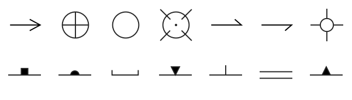

# Simple geologic symbol set for QGIS

I had some requests to port my geologic symbols from
[GRASS GIS](https://grass.osgeo.org/learn/overview/)'s
[symbol format](https://grasswiki.osgeo.org/wiki/IconSymbols#New)
into SVG for use with
[QGIS](https://www.qgis.org/), so here they are in
the hope that they are useful.

I just coded the SVG by hand, improvements welcome. If you want
to edit them in [Inkscape](https://inkscape.org/) or use them
elsewhere you'll probably have to edit the files to remove the
dynamic parameters for stroke and fill that allow the QGIS user
to modify the styling on the fly.

A more complete set is available from
[Rodreras's collection](https://github.com/rodreras/geologic_icons/)
of symbols from the USGS's [FGDC Digital Cartographic Standard for
Geologic Map Symbolization](https://pubs.usgs.gov/tm/2006/11A02/).
These are also available from the
[QGIS Resource Sharing](https://plugins.qgis.org/plugins/qgis_resource_sharing/)
plugin.

Another set of the USGS symbols is available from 
[Stefan Revets's repo](https://sourceforge.net/projects/qgisgeologysymbology/files/).
Copy the SVG files into a local folder and then let QGIS know
where to find them by adding the directory with:
Settings menu > Options > System tab > SVG Paths > "+" button.

 
These symbols are licensed under the GNU GPL, version 2 or later.

  
M. Hamish Bowman 
Department of Geology 
University of Otago 
Dunedin, New Zealand

20 Feb 2025
